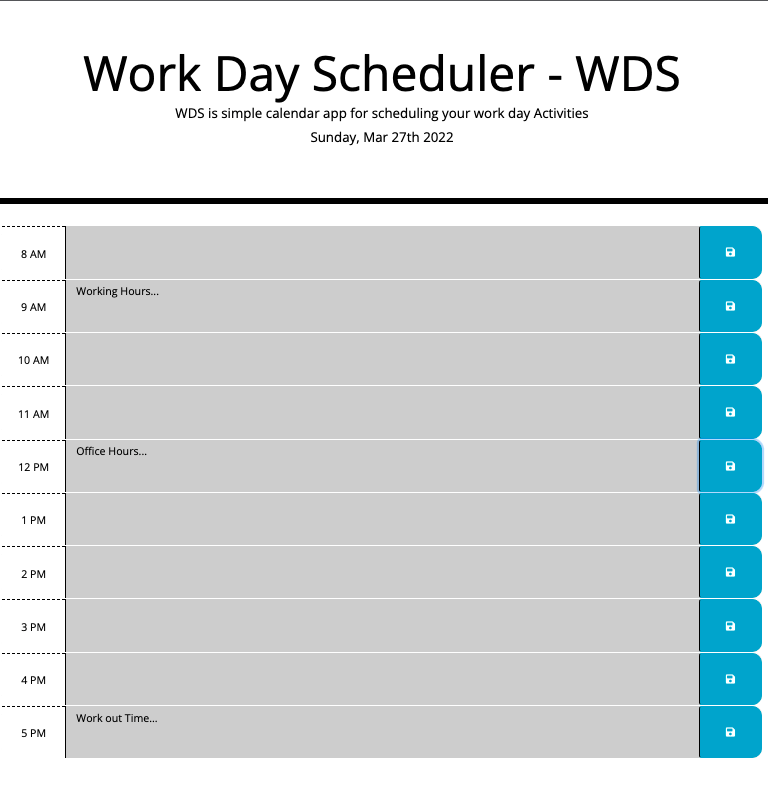

# Work Day Scheduler - WDS

## About me
I am GW coding student, looking to solve problems, I have a passion for learning  and sharing my knowlege with other as publicaly as possible, if you found value in something I have created, please feel free to give me a shout out @Tariqstanikizai, fell free to reach out in case you want to just get in touch also.

## Purpose:
WDS is simple calendar app for scheduling your work day Activities

## WDS Features :
Using a daily planner to create a schedule.
The current day and Date are displayed at the top of the calendar.
Each time block is color-coded to indicate whether it is in the past, present, or future.
Text for event is saved in local storage.

## Technology in Used :
* HTML
* CSS
* JAVA SCRIPT
* jQuery
* Bootstrap

## The following image demonstrates the application functionality:

## Usage:
This should only be used as an exploration or educational project.

## Links:

* The URL of the deployed application.

* The URL of the GitHub repository.
 https://github.com/Tariqstanikzai/Work-Day-Scheduler-WDS 

## Contact
 * @tariq_stanikzai